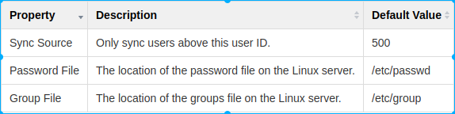
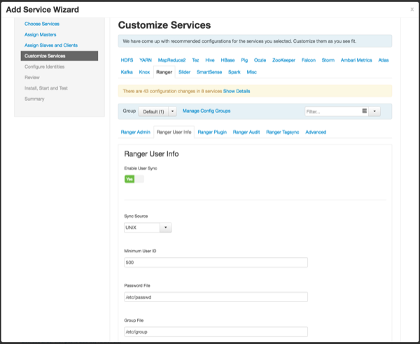
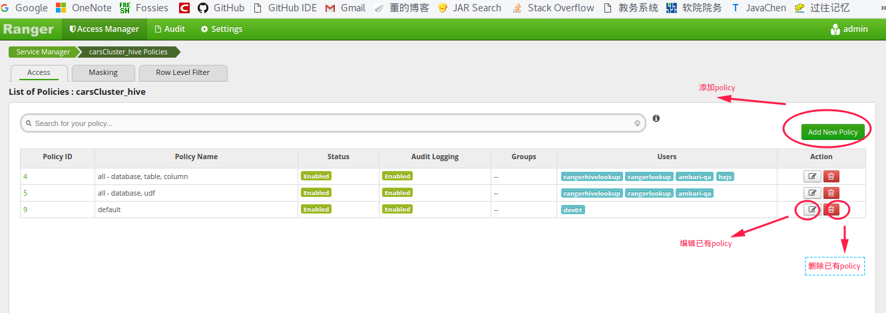

大数据服务软件安装手册
===================
[TOC]

# 基础环境准备

使用脚本完成基础环境的准备之后，ambari-server及ambari-agent都已完成安装，并且ambari-agent完成启动。

## 目录结构

```
.
├── configs
│   ├── disable-thp.service
│   └── vars.yml
├── hosts
│   └── inventory
├── package
│   ├── ambari.repo
│   ├── hdp-2.6-centos7
│   │   ├── ambari-2.5.0.3-centos7.tar.gz
│   │   ├── ambari.repo
│   │   ├── HDP-2.6.0.3-centos7-rpm.tar.gz
│   │   └── HDP-UTILS-1.1.0.21-centos7.tar.gz
│   ├── hdp.repo
│   ├── hdp-util.repo
│   ├── jdk
│   │   ├── jce_policy-8.zip
│   │   └── jdk-8u131-linux-x64.tar.gz
│   ├── libtirpc-devel
│   │   ├── libtirpc-devel-0.2.4-0.10.el7.x86_64.rpm
│   │   ├── libtirpc-devel-0.2.4-0.6.el7.x86_64.rpm
│   │   ├── libtirpc-devel-0.2.4-0.8.el7.i686.rpm
│   │   └── libtirpc-devel-0.2.4-0.8.el7.x86_64.rpm
│   └── postgresql95
│       ├── postgresql95-9.5.7-1PGDG.rhel7.x86_64.rpm
│       ├── postgresql95-contrib-9.5.7-1PGDG.rhel7.x86_64.rpm
│       ├── postgresql95-devel-9.5.7-1PGDG.rhel7.x86_64.rpm
│       ├── postgresql95-libs-9.5.7-1PGDG.rhel7.x86_64.rpm
│       └── postgresql95-server-9.5.7-1PGDG.rhel7.x86_64.rpm
├── playbooks
│   ├── cluster_start.yml
│   ├── set_env_ol6.yml
│   ├── set_env_ol7.yml
│   └──ssh-addkey.yml
└── README.md
```

## 安装和配置Ansible

1. Install pip

```
sudo apt-get install python-pip
sudo pip install -U setuptools
sudo pip install -U pip
```
2. Install ansible via pip

```
sudo pip install ansible
```
3. Install sshpass

```shell
sudo apt-get install sshpass
```
4. Set host key checking disabled

```shell
cat > ~/.ansible.cfg << EOF
[defaults]
host_key_checking = False
EOF
```
## 编辑主机列表文件

​	setup-env-for-ambari/hosts/inventory

```
[control-node]
192.168.3.181 ansible_ssh_user=samsing  ansible_ssh_pass=samsing timeout=90 ansible_become=yes ansible_become_user=root ansible_become_pass=redhat ansible_become_method=su ansible_become_flags='-'

[manage-node]
192.168.3.182 ansible_ssh_user=samsing  ansible_ssh_pass=samsing timeout=90 ansible_become=yes ansible_become_user=root ansible_become_pass=redhat ansible_become_method=su ansible_become_flags='-'
192.168.3.183 ansible_ssh_user=samsing  ansible_ssh_pass=samsing timeout=90 ansible_become=yes ansible_become_user=root ansible_become_pass=redhat ansible_become_method=su ansible_become_flags='-'

[data-node]
192.168.3.182 ansible_ssh_user=samsing  ansible_ssh_pass=samsing timeout=90 ansible_become=yes ansible_become_user=root ansible_become_pass=redhat ansible_become_method=su ansible_become_flags='-'
192.168.3.183 ansible_ssh_user=samsing  ansible_ssh_pass=samsing timeout=90 ansible_become=yes ansible_become_user=root ansible_become_pass=redhat ansible_become_method=su ansible_become_flags='-'
```

​	[control-node]表示一个组

​	ansible_ssh_user=samsing 表示使用用户samsing连接

​	ansible_ssh_pass=samsing 表示连接使用的密码

​	timeout=90 连接超时时间

​	如果目标主机不允许使用root用户进行连接的话需要添加如下配置：

​	ansible_become=yes 

​	ansible_become_user=root 

​	ansible_become_pass=redhat 

​	ansible_become_method=su 

​	ansible_become_flags='-'

**一定记得根据实际环境情况对ip及用户信息进行相应的修改**

## 编辑变量文件

setup-env-for-ambari/configs/vars.yml

```shell
net_work: 10.2.211.0
net_mask: 255.255.255.0

hostname_vars:
  - ip: 192.168.3.181
    hostname_long: auto-cn-01.embrace.com
    hostname_short: auto-cn-01

  - ip: 192.168.3.182
    hostname_long: auto-nn-01.embrace.com
    hostname_short: auto-nn-01

  - ip: 192.168.3.183
    hostname_long: auto-nn-02.embrace.com
    hostname_short: auto-nn-02

```

**主要是修改内容:**

1. net_work

2. net_mask

3. hostname_vars

   该变量主要用于配置/etc/hosts文件

   ```
     - ip: 192.168.3.181
       hostname_long: auto-cn-01.embrace.com
       hostname_short: auto-cn-01

   ```

   对应/etc/hosts中的一个条目： 192.168.3.181 auto-cn-01.embrace.com auto-cn-01

## 脚本使用方法及简介

1. 使用方法

```
cd setup-env-for-ambari
ansible-playbook -i hosts/inventory playbooks/set_env_ol7.yml
```

2. playbook简介

   playbook使用yaml格式。

   一个palybook可以对应多个play,一个play可以对应操作多个host,同时一个play包含多个task,一个task操作一个moduel。

```
- name: close firewall,selinux; modify hostname
  hosts: all #执行tasks的主机
  vars_files: #引用变量文件
    - ../configs/vars.yml  
  tasks:   # task列表
    - name: close firewall #task名称
      service: #task所使用的module
        name: firewalld
        state: stopped
        enabled: no

    - name: close selinux temporarily
      shell: setenforce 0
      ignore_errors: yes

    - name: colse selinux Permanently
      lineinfile:
        dest: /etc/selinux/config
        regexp: 'SELINUX='
        line: 'SELINUX=disabled'

    - name: modify hostname
      hostname:
        name: "{{ item['hostname_short'] }}"
      with_items: "{{ hostname_vars }}" #loop
      when: inventory_hostname == item['ip'] #condition

    - name: modify /etc/hosts
      lineinfile:
        dest: /etc/hosts
        regexp: "{{ item['ip'] }}"
        line: "{{ item['ip'] }} {{ item['hostname_long'] }} {{ item['hostname_short'] }}"
        state: present
      with_items: "{{ hostname_vars }}"
```

# 图形化安装HDP

## ambari-server setup

**注意：再配置ambari过程中，ambari所使用的元数据库一定要提前建好。**


## ambari-server启动

启动：ambari-server start
访问页面：http://<ambari server host>:8080/

## 图形化安装hdp

### 安装hdp
访问：http:// <ambari host name>:8080/ --> admin/admin登录 ，具体的安装步骤如下
1. 点击launch install wizard开始安装，如下图：
  

2. 填写集群的名字
  

3. 选择本地yum源
  

4. 填写集群要安装的节点信息，并选择ambari agent的安装注册方式
  
  **注意：使用自动化脚本完成基础环境的准备之后，ambari-agent便完成了安装，并且已经启动**

5. 确认集群节点的信息
  
  上图底下有个“ Click hereto see the warnings.” 按钮，打开后会显示主机上的各种警告信息，虽然已经安装了 ambari－agent,可是还有其他可能导致安装集群失败的潜在不足，比如 ntp没做，或防火墙规则存在，虽然放行了 ssh，但是等安装hadoop集群，需要打开很多的tcp 端口，可能会导致错误发生。自己视情况检查吧（我这个环境因为安装过HDP,许多提示都是说已经安装了某包，有某些配置文件已存在等等）。一定要确保所有的检测都通过，否则安装过程中会出现错误。
  

6. 选择要安装的服务
  

7. 选择各服务 master组件 安装的节点，一般都放在管理节点上面
  

8.选择各服务 slaves和client 服务安装的节点，一般安装在数据节点上面


9. 根据自身需求自定义一些服务的配置，**如果有显示红色标记的配置项，一定要配置**，否则无法进行下一步。**下面涉及到数据库的地方，一定要提前先建立好相应的数据库**，除了下面的一些配置外，生产中还需要一些额外的配置，配置项参考链接：[服务配置规范](http://119.254.33.210/confluence/pages/viewpage.action?pageId=9765156)。
    1. 在hive标签页，配置hive元数据库
      
    2. 在Ambari Metrics标签页，配置grafana admin的密码
      
    3. 配置Smartsense标签页，配置Activity Explorer admin用户的密码
      

10. 检查所要安装服务的信息
  

11. 安装，启动和测试，如果安装过程中没有错误，那么直接点击完成，如果出现错误，则需要查看具体的错误，直接点击错误链接即可查看错误信息，错误解决后，点击 retry 按钮，重试安装。
   
   

### 重新安装hdp
1. 停止所有启动的服务
2. 删除pg数据库中的ambari元数据库
3. 重新设置ambari server
    ```
    ambari-server setup
    ```
4. 删除hadoop集群相关配置文件，需在每台机器上执行
    ```shell
    yum -y erase hdp-select
    python /usr/lib/python2.6/site-packages/ambari_agent/HostCleanup.py --silent --skip=users
    ```
5. 再次界面安装

## 服务可用性检查
1. HDFS检查
    ```shell
    su - hadoop
    hdfs dfs -put ~/.bashrc /
    hdfs dfs -cat /.bashrc
    ```
2. Yarn和MapReduce检查
    ```
    su - hadoop
    hdfs dfs -mkdir /testin
    hdfs dfs -put ~/.bashrc /testin
    hadoop jar /usr/hdp/2.6.0.3-8/hadoop-mapreduce/hadoop-mapreduce-examples-2.7.3.2.6.0.3-8.jar     wordcount /testin/ /testout
    同时登录 http://<resource_manager_host>:8088  --> Applications --> running 查看是否有刚才提交的任务
    ```
3. Hive检查
    ```su - hadoop
    hive
    hive>  create table people(id string, name string);
    OK
    hive> insert into people values("1","louis");
    Query ID = hadoop_20170620112529_356f40fa-60d4-4c25-9728-ee3ff6adb49c
    Total jobs = 1
    Launching Job 1 out of 1
    Status: Running (Executing on YARN cluster with App id application_1497866533048_0004)
     
    --------------------------------------------------------------------------------
            VERTICES      STATUS  TOTAL  COMPLETED  RUNNING  PENDING  FAILED  KILLED
    --------------------------------------------------------------------------------
    Map 1 ..........   SUCCEEDED      1          1        0        0       0       0
    --------------------------------------------------------------------------------
    VERTICES: 01/01  [==========================>>] 100%  ELAPSED TIME: 7.23 s    
    --------------------------------------------------------------------------------
    Loading data to table default.people
    Table default.people stats: [numFiles=1, numRows=1, totalSize=8, rawDataSize=7]
    OK
    Time taken: 11.96 seconds
    hive> select * from people;
    OK
    1       louis
    Time taken: 0.393 seconds, Fetched: 1 row(s)
    ```
4. Hbase检查
    ```su - hadoop
    hbase shell
     
    //创建表
    hbase(main):001:0> create 'test','cf'
    0 row(s) in 4.8910 seconds
     
    => Hbase::Table - test
    //查看所有表
    hbase(main):002:0> list
    TABLE                                                                                                                                         
    test                                                                                                                                          
    1 row(s) in 0.0560 seconds
     
    => ["test"]
    //往表里面插入数据
    hbase(main):003:0> put 'test','row1','cf:a','value1'
    0 row(s) in 0.3720 seconds
     
    hbase(main):004:0> put 'test','row2','cf:b','value2'
    0 row(s) in 0.0270 seconds
     
    hbase(main):005:0> put 'test','row3','cf:3','value3'
    0 row(s) in 0.0220 seconds
     
    //扫描表中的所有数据
    hbase(main):006:0> scan 'test'
    ROW                                 COLUMN+CELL                                                                                               
     row1                               column=cf:a, timestamp=1497929482464, value=value1                                                        
     row2                               column=cf:b, timestamp=1497929489695, value=value2                                                        
     row3                               column=cf:3, timestamp=1497929495188, value=value3                                                        
    3 row(s) in 0.0680 seconds
     
    //获取表中的一条数据
    hbase(main):007:0> get 'test','row1'
    COLUMN                              CELL                                                                                                      
     cf:a                               timestamp=1497929482464, value=value1                                                                     
    1 row(s) in 0.0550 second
    ```
5. spark检查
    ```su - hadoop
    // 使用spark-submit提交任务
    spark-submit --class org.apache.spark.examples.SparkPi \
    --master yarn --deploy-mode client \
    --driver-memory 1G --executor-memory 1G \
    --executor-cores 1 /usr/hdp/2.6.0.3-8/spark/lib/spark-examples-1.6.3.2.6.0.3-8-hadoop2.7.3.2.6.0.3-8    .jar 40
    输出的结果中会有：
    17/06/20 11:48:02 INFO DAGScheduler: Job 0 finished: reduce at SparkPi.scala:36, took 4.955870 s
    Pi is roughly 3.1410777852694465
     
    // 使用spark-shell连接hive
    spark-shell
    scala> val result = sqlContext.sql("select * from default.people")
    scala> result.show
    +---+-----+
    | id| name|
    +---+-----+
    |  1|louis|
    +---+-----+
    ```

    ​

# 安全配置

## HDP2.6—Kerberos&Openldap安装集成

**注意：**
1. 实验中的域使用的是CARS.COM,需要根据自己的情况进行相应的修改
2. 编辑ldif文件的时候，直接拷贝下面的内容可能会存在格式问题，多个空格什么的都不可以,编辑的时候需要格外注意

### 1. openldap安装
    安装在集群的控制节点上，即Ambari机器所在的节点上
1. 安装
    ```shell
    yum install db4 db4-utils db4-devel cyrus-sasl* krb5-server-ldap -y
    yum -y install openldap compat-openldap openldap-clients openldap-servers openldap-servers-sql openldap-devel
    ```
2. 拷贝库文件
    ```
    cp /usr/share/openldap-servers/DB_CONFIG.example /var/lib/ldap/DB_CONFIG
    chown ldap:ldap /var/lib/ldap/*
    ```
3. 配置openldap日志
    ```
    mkdir /var/log/slapd
    chmod 755 /var/log/slapd/
    chown ldap:ldap /var/log/slapd/
    sed -i "/local4.*/d" /etc/rsyslog.conf

    #copy paste the next 4 lines together
    cat >> /etc/rsyslog.conf << EOF
    local4.*                        /var/log/slapd/slapd.log
    EOF

    #重启rsyslog
    systemctl restart rsyslog
    ```
4. 启动并设置开机自启
    ```
    systemctl enable slapd.service
    systemctl start slapd.service

    #检验
    netstat -antup | grep -i 389

    如果启动失败，则运行下面命令来启动 slapd 服务并查看日志：
    $ slapd -h ldap://127.0.0.1 -d 481
    ```
5. 设置rootdn的密码
    ```
    # slappasswd
    New password:
    Re-enter new password:
    {SSHA}/nwQPS8n7k8gmfThCnR1YdMfY9uR5Q7n
    ```
6. 设置openLDAP的rootdn

    **注意：olcRootPW处填写上面生成的密码，ldif文件是通过使用ldap自带命令修改ldap配置的;每个dn表示一个单元，每个单元之间有一空行，空行中绝不能包含空格或tab,否则执行会报错;每个非空白行中的冒号后都有个空格**
    ```
    # vi db.ldif
    dn: olcDatabase={2}hdb,cn=config
    changetype: modify
    replace: olcSuffix
    olcSuffix: dc=cars,dc=com

    dn: olcDatabase={2}hdb,cn=config
    changetype: modify
    replace: olcRootDN
    olcRootDN: cn=root,dc=cars,dc=com

    dn: olcDatabase={2}hdb,cn=config
    changetype: modify
    add: olcRootPW
    olcRootPW: {SSHA}/nwQPS8n7k8gmfThCnR1YdMfY9uR5Q7n

    # 执行：
    ldapmodify -Y EXTERNAL  -H ldapi:/// -f db.ldif
    ```
7. 修改monitor权限，只有rootdn可读，其实不修改也是可以的(CN=Monitor是一个LDAP目录服务器监控工具，具体作用参考http://cnmonitor.sourceforge.net/)：
    ```
    # vi monitor.ldif
    dn: olcDatabase={1}monitor,cn=config
    changetype: modify
    replace: olcAccess
    olcAccess: {0}to * by dn.base="gidNumber=0+uidNumber=0,cn=peercred,cn=external,cn=auth" read by dn.base="cn=root,dc=cars,dc=com" read by * none

    # 执行：
    ldapmodify -Y EXTERNAL  -H ldapi:/// -f monitor.ldif
    ```
8. 添加常用schama
    ```
    ldapadd -Y EXTERNAL  -H ldapi:/// -f /etc/openldap/schema/collective.ldif
    ldapadd -Y EXTERNAL  -H ldapi:/// -f /etc/openldap/schema/corba.ldif
    ldapadd -Y EXTERNAL  -H ldapi:/// -f /etc/openldap/schema/cosine.ldif
    ldapadd -Y EXTERNAL  -H ldapi:/// -f /etc/openldap/schema/duaconf.ldif
    ldapadd -Y EXTERNAL  -H ldapi:/// -f /etc/openldap/schema/dyngroup.ldif
    ldapadd -Y EXTERNAL  -H ldapi:/// -f /etc/openldap/schema/inetorgperson.ldif
    ldapadd -Y EXTERNAL  -H ldapi:/// -f /etc/openldap/schema/java.ldif
    ldapadd -Y EXTERNAL  -H ldapi:/// -f /etc/openldap/schema/misc.ldif
    ldapadd -Y EXTERNAL  -H ldapi:/// -f /etc/openldap/schema/nis.ldif
    ldapadd -Y EXTERNAL  -H ldapi:/// -f /etc/openldap/schema/openldap.ldif
    ldapadd -Y EXTERNAL  -H ldapi:/// -f /etc/openldap/schema/pmi.ldif
    ldapadd -Y EXTERNAL  -H ldapi:/// -f /etc/openldap/schema/ppolicy.ldif
    ```
9. 添加kerberos schema
    ```
    cp /usr/share/doc/krb5-server-ldap-1.13.2/kerberos.* /etc/openldap/schema/
     
    mkdir /tmp/ldap-kerberos/

    echo "include /etc/openldap/schema/kerberos.schema" > /tmp/ldap-kerberos/schema_convert.conf
       
    mkdir /tmp/ldap-kerberos/krb5_ldif

    slaptest -f /tmp/ldap-kerberos/schema_convert.conf -F /tmp/ldap-kerberos/krb5_ldif

    # 编辑 /tmp/ldap-kerberos/krb5_ldif/cn=config/cn=schema/cn={0}kerberos.ldif 并且替换
    dn: cn={0}kerberos
    cn: {0}kerberos
    为
    dn: cn=kerberos,cn=schema,cn=config
    cn: kerberos
    同时删除文件末尾的如下几行：
    structuralObjectClass: olcSchemaConfig
    entryUUID: ...
    creatorsName: cn=config
    createTimestamp: ...
    entryCSN: ...
    modifiersName: cn=config
    modifyTimestamp: ...

    执行：
    ldapadd -Y EXTERNAL  -H ldapi:/// -f /tmp/ldap-kerberos/krb5_ldif/cn=config/cn=schema/cn={0}kerberos.ldif
    ```
10. 添加kerberos相关的index，加速查询
  ```
  # vi index.ldif
  dn: olcDatabase={2}hdb,cn=config
  add: olcDbIndex
  olcDbIndex: krbPrincipalName eq,pres,sub

  执行：
  ldapmodify -Y EXTERNAL  -H ldapi:/// -f index.ldif
  ```
11. 创建ssl certificate
    **注意：生成过程中的Common Name一定要写openLDAP所在主机的FQDN（FQDN:完整格式域名，例如：bigdata-cn-01.cars.com）**
    ```
    # 将生成的证书还有私钥放在/etc/openldap/certs/下
    $ openssl req -new -x509 -nodes -out /etc/openldap/certs/ldapcert.pem -keyout /etc/openldap/certs/ldapkey.pem -days 365
    Generating a 2048 bit RSA private key
    ..+++
    .................+++
    writing new private key to '/etc/openldap/certs/ldapkey.pem'
    -----
    You are about to be asked to enter information that will be incorporated
    into your certificate request.
    What you are about to enter is what is called a Distinguished Name or a DN.
    There are quite a few fields but you can leave some blank
    For some fields there will be a default value,
    If you enter '.', the field will be left blank.
    -----
    Country Name (2 letter code) [XX]:CN
    State or Province Name (full name) []:Beijing
    Locality Name (eg, city) [Default City]:Beijing
    Organization Name (eg, company) [Default Company Ltd]:cars.com
    Organizational Unit Name (eg, section) []:People
    Common Name (eg, your name or your server's hostname) []:bigdata-cn-01.cars.com
    Email Address []:373789278@qq.com
     
    # 修改证书权限
    chown -R ldap:ldap /etc/openldap/certs/*.pem
    # 验证
    ll /etc/openldap/certs/*.pem
    -rw-r--r--. 1 ldap ldap 1440 Oct 10 02:31 /etc/openldap/certs/ldapcert.pem
    -rw-r--r--. 1 ldap ldap 1704 Oct 10 02:31 /etc/openldap/certs/ldapkey.pem
    ```
12. 配置openLDAP ssl证书
    ```
    # vi certs.ldif
    dn: cn=config
    changetype: modify
    replace: olcTLSCertificateFile
    olcTLSCertificateFile: /etc/openldap/certs/ldapcert.pem

    dn: cn=config
    changetype: modify
    replace: olcTLSCertificateKeyFile
    olcTLSCertificateKeyFile: /etc/openldap/certs/ldapkey.pem

    # 执行
    ldapmodify -Y EXTERNAL  -H ldapi:/// -f certs.ldif
    # 检查证书
    slaptest -u
    # 返回如下信息说明正常
    config file testing succeeded
    ```
13. 配置ldap客户端,修改BASE和URI
    ```
    # vi /etc/openldap/ldap.conf
    #
    # LDAP Defaults
    #
     
    # See ldap.conf(5) for details
    # This file should be world readable but not world writable.

    BASE    dc=cars,dc=com
    URI     ldap://bigdata-cn-01.cars.com ldaps://bigdata-cn-01.cars.com:636

    #SIZELIMIT      12
    #TIMELIMIT      15
    #DEREF          never

    TLS_CACERTDIR   /etc/openldap/certs

    # Turning this off breaks GSSAPI used with krb5 when rdns = false
    SASL_NOCANON    on
    ```
14. 服务端启用openLDAP ssl
    ```
    # vi /etc/sysconfig/slapd
     
    # OpenLDAP server configuration
    # see 'man slapd' for additional information
     
    # Where the server will run (-h option)
    # - ldapi:/// is required for on-the-fly configuration using client tools
    #   (use SASL with EXTERNAL mechanism for authentication)
    # - default: ldapi:/// ldap:///
    # - example: ldapi:/// ldap://127.0.0.1/ ldap://10.0.0.1:1389/ ldaps:///
    SLAPD_URLS="ldapi:/// ldap://bigdata-cn-01.cars.com/ ldaps://bigdata-cn-01.cars.com:636"
     
    # Any custom options
    #SLAPD_OPTIONS=""
     
    #修改完成后，重启openLDAP
    systemctl restart slapd
    ```
15. 在openLDAP中添加相关条目（添加basedn、rootdn、组等一些条目，其中组可以根据自己的需求添加）
    **注意：每个dn表示一个单元，每个单元之间有一空行，空行中绝不能包含空格或tab,否则执行会报错;每个非空白行中的冒号后都有个空格**
    ```
    # vi base.ldif
    dn: dc=cars,dc=com
    dc: cars
    objectClass: top
    objectClass: domain

    dn: cn=root,dc=cars,dc=com
    objectClass: organizationalRole
    cn: root
    description: LDAP Manager

    dn: ou=People,dc=cars,dc=com
    objectClass: organizationalUnit
    ou: People

    dn: ou=Group,dc=cars,dc=com
    objectClass: organizationalUnit
    ou: Group

    #执行
    ldapadd -x -W -D "cn=root,dc=cars,dc=com" -f base.ldif
    ```
16. 修改acl权限：（用于控制 kadmin和kdc条目对LDAP数据库的读写权限，本实验直接将rootdn作为了kadmin dn和kdc dn。关于openldap acl的更详细配置参考：http://www.openldap.org/doc/admin24/access-control.html）
    ```
    #vi acl.ldif
    dn: olcDatabase={2}hdb,cn=config
    replace: olcAccess
    olcAccess: to attrs=userPassword,shadowLastChange,krbPrincipalKey by dn="cn=root,dc=cars,dc=com" write by anonymous auth by self write by * none

    add: olcAccess
    olcAccess: to * by dn="cn=root,dc=cars,dc=com" write by * read

    add: olcAccess
    olcAccess: to dn.base="" by * read

    # 执行
    ldapmodify -Y EXTERNAL  -H ldapi:/// -f acl.ldif
    ```

### 2. 安装配置kdc
1. 安装kerberos服务
    ```
    yum install krb5-server krb5-libs krb5-workstation -y
    ```
2. 编辑kdc权限文件，并修改如下：
    **注意：CARS.COM要使用环境的域名进行相应的替换**
    ```
    # vi /var/kerberos/krb5kdc/kadm5.acl
    */admin@CARS.COM        *
    ```
3. 编辑 kdc服务端配置文件,并修改如下：
    **添加[dbdefaults]、[dbmodules]模块，将[realms]模块下的  EXAMPLE.COM  修改为自己的域，并且添加 database_module = openldap_ldapconf 和 default_principal_flags = +preauth 属性**
    ```
    # vi /var/kerberos/krb5kdc/kdc.conf
     
    [kdcdefaults]
     kdc_ports = 88
     kdc_tcp_ports = 88
     v4_mode = nopreauth
     
    [realms]
     CARS.COM = {
      #master_key_type = aes256-cts
      acl_file = /var/kerberos/krb5kdc/kadm5.acl
      dict_file = /usr/share/dict/words
      admin_keytab = /var/kerberos/krb5kdc/kadm5.keytab
      supported_enctypes = aes256-cts:normal aes128-cts:normal des3-hmac-sha1:normal arcfour-hmac:normal camellia256-cts:normal camellia128-cts:normal des-hmac-sha1:normal des-cbc-md5:normal des-cbc-crc:normal
      database_module = openldap_ldapconf
      default_principal_flags = +preauth
     }
     
    [dbdefaults]
     ldap_kerberos_container_dn = cn=krbContainer,ou=People,dc=cars,dc=com
     
    [dbmodules]
     openldap_ldapconf = {
      db_library = kldap
      ldap_kdc_dn = cn=root,dc=cars,dc=com
      ldap_kadmind_dn = cn=root,dc=cars,dc=com
      ldap_service_password_file = /var/kerberos/krb5kdc/service.keyfile
      ldap_servers = ldaps://bigdata-cn-01.cars.com:636 ldap://bigdata-cn-01.cars.com
      ldap_conns_per_server = 5
     }
    ```
4. 编辑kdc客户端文件，并编辑如下:
    **将[libdefaults] 模块下的default_realm属性修改为自己的域；[realms] 下面的 EXAMPLE.COM 修改为自己的域，admin_server和kdcs 属性修改为自己kadmin和kdc服务所在的机器；**
    ```
    vi /etc/krb5.conf

    [libdefaults]
      renew_lifetime = 7d
      forwardable = true
      default_realm = CARS.COM
      ticket_lifetime = 24h
      dns_lookup_realm = false
      dns_lookup_kdc = false
      default_ccache_name = /tmp/krb5cc_%{uid}
      #default_tgs_enctypes = aes des3-cbc-sha1 rc4 des-cbc-md5
      #default_tkt_enctypes = aes des3-cbc-sha1 rc4 des-cbc-md5

    [logging]
      default = FILE:/var/log/krb5kdc.log
      admin_server = FILE:/var/log/kadmind.log
      kdc = FILE:/var/log/krb5kdc.log

    [realms]
      CARS.COM = {
        admin_server = bigdata-cn-01.cars.com
        kdc = bigdata-cn-01.cars.com
      }
    ```
5. 创建 LDAP/Kerberos container:
    **注意:对域名进行相应的替换**
    ```
    # kdb5_ldap_util -D  cn=root,dc=cars,dc=com create -s
    Password for "cn=root,dc=cars,dc=com":
    Initializing database for realm 'CARS.COM'
    You will be prompted for the database Master Password.
    It is important that you NOT FORGET this password.
    Enter KDC database master key:
    Re-enter KDC database master key to verify:
    ```
6. 创建 admin password
    **注意：生成的文件的位置和在kdc.conf中配置的 ldap_service_password_file 一样**
    ```
    # kdb5_ldap_util -D  cn=root,dc=cars,dc=com  stashsrvpw -f /var/kerberos/krb5kdc/service.keyfile cn=root,dc=cars,dc=com
    Password for "cn=root,dc=cars,dc=com":
    Password for "cn=root,dc=cars,dc=com":
    Re-enter password for "cn=root,dc=cars,dc=com":
    ```
7. 启动krb5kdc和kadmin并设置开机自启动
    ```
    systemctl start krb5kdc kadmin
    systemctl enable krb5kdc kadmin
    ```
8. 在Kerberos安全机制里，一个principal就是realm里的一个对象，一个principal总是和一个密钥（secret key）成对出现的。这个principal的对应物可以是service，可以是host，也可以是user，对于Kerberos来说，都没有区别。Kdc(Key distribute center)知道所有principal的secret key，但每个principal对应的对象只知道自己的那个secret key。这也是 "共享密钥" 的由来。为了使 Kerberos 能够绑定到 OpenLDAP 服务器，请创建一个管理员用户和一个 principal，并生成 keytab 文件，设置该文件的权限为 LDAP 服务运行用户可读（ LDAP 服务运行用户一般为 ldap）：
    ```
    $ kadmin.local -q "addprinc root/admin@CARS.COM"
    $ kadmin.local -q "addprinc -randkey ldap/bigdata-cn-01.cars.com@CARS.COM"
    $ kadmin.local -q "xst -k /etc/openldap/ldap.keytab ldap/bigdata-cn-01.cars.com@CARS.COM"
     
    $ chown ldap:ldap /etc/openldap/ldap.keytab && chmod 640 /etc/openldap/ldap.keytab
     
    注：ktadd 后面的-k 指定把 key 存放在一个本地文件中。
     
    使用 root/admin 测试：
    kinit root/admin
    系统会提示输入密码，如果一切正常，那么会安静的返回。实际上，你已经通过了kerberos的身份验证，且获得了一个Service TGT(Ticket-Granting Ticket). Service TGT的意义是， 在一段时间内，你都可以用此TGT去请求某些service，比如ldap service，而不需要再次通过kerberos的认证。
    ```
9. 确保 LDAP 启动时使用上一步中创建的keytab文件，在 /etc/sysconfig/slapd 增加 KRB5_KTNAME 配置：
    ```
    KRB5_KTNAME=/etc/openldap/ldap.keytab
     
    # 重启slapd
    systemctl restart slapd
    ```

### 3. 通过ambari管理界面启用kerberos
1. 登录ambari管理界面，点击 admin --》 kerberos --》 enable kerberos，如下图：
  

2. 选择Existing MIT KDC，并勾选下面的checkbox，点击 next
  

3. 填写kdc和kadmin一些相关的信息，如下图，确认没有问题后，点击next
  

4. 安装测试没有问题后，点击next
  

5. 配置identiites，基本不用修改，直接下一步即可
  

6. 确认一下信息，没有问题直接下一步
  

7. 停止服务，完成后，点击下一步
  

8. kerberize 化集群，完成后，点击下一步
  

9. 启动并测试服务，成功后，直接点击 complete

### 参考链接
> http://www.itzgeek.com/how-tos/linux/centos-how-tos/step-step-openldap-server-configuration-centos-7-rhel-7.html
> http://wiki.polaire.nl/doku.php?id=rhel7_kerberos
> https://docs.hortonworks.com/HDPDocuments/HDP2/HDP-2.6.0/bk_security/content/_optional_install_a_new_mit_kdc.html
> http://secfree.github.io/blog/2015/06/29/kerberos-ldap-deploy.html#测试
> https://segmentfault.com/a/1190000002532332#articleHeader7
> https://wiki.debian.org/LDAP/OpenLDAPSetup#Configuring_TLS.2FSSL
> http://jfcarter.net/~jimc/documents/ldap/kerberos-ldap-1202.html
> http://web.mit.edu/Kerberos/krb5-1.13/doc/admin/conf_ldap.html
> https://github.com/abajwa-hw/security-workshops/blob/master/Setup-OpenLDAP-PAM.md
> https://segmentfault.com/a/1190000002607140
> http://www.rjsystems.nl/en/2100-d6-kerberos-openldap-provider.php

## 实现基于OpenLDAP Linux操作系统用户统一管理

### 1. openldap 认证配置：
* 关闭客户端防火墙：
    ```
    systemctl stop firewalld
    systemctl disable firewalld
    ```

* 关闭客户端selinux: 
    ```
    //永久关闭，需要重启
    #vi /etc/selinux/config
    设置：SELINUX=disabled
    //临时关闭
    setenforce 0
    ```

* 在客户端上添加openldap服务端的hostname
    ```
    # vim /etc/hosts
    172.16.0.227 bigdata-cn-01.cars.com bigdata-cn-01
    ```

* 在客户机上安装openldap客户端
    ```
    # 安装
    yum install -y openldap openldap-clients nss-pam-ldapd
    # 设置nscd，nslcd开机自启
    systemctl enable nscd nslcd
    ```

* 从服务器拷贝cacert文件
    ```
    # 创建cacerts目录
     mkdir /etc/openldap/cacerts
     #拷贝
     scp root@bigdata-cn-01.cars.com:/etc/openldap/certs/ldapcert.pem /etc/openldap/cacerts
     # tls解析cacerts文件
     /etc/pki/tls/misc/c_hash /etc/openldap/cacerts/ldapcert.pem
     结果： 81a81b99.0 => ldapcert.pem
     将81a81b99.0 关联到 ldapcert.pem ：ln -s /etc/openldap/cacerts/ldapcert.pem /etc/openldap/cacerts/81a81b99.0
    ```

* 将系统用户认证切换到LDAP
    ```
    authconfig --enableforcelegacy --enableldap --enableldapauth --enableldaptls --ldapserver="bigdata-nn-02.cars.com" --ldapbasedn="dc=cars,dc=com" --enablemkhomedir --update
    ```

* 测试ldap连接是否配置成功
    ```
    正常模式：ldapsearch -b "dc=cars,dc=com" -D "cn=root,dc=cars,dc=com" -W -x -H ldaps://bigdata-cn-01.cars.com:636
    debug模式：ldapsearch -b "dc=cars,dc=com" -D "cn=root,dc=cars,dc=com" -W -x -H ldaps://bigdata-cn-01.cars.com:636 -d 245
    ```

* 在openldap服务端添加一个用户ldapuser，然后在客户端测试认证
    ```
    getent passwd ldapuser 

    如果返回用户刚才添加用户的相关信息，说明认证成功。
    ```

### 2. 现有系统用户迁移

* 安装迁移工具
    ```
    yum install migrationtools -y
    ```

* 修改相关参数
    ```
    cd /usr/share/migrationtools/
    vi migrate_common.ph
    修改：
    # Default DNS domain
    $DEFAULT_MAIL_DOMAIN = "jt.com"
     
    # Default base
    $DEFAULT_BASE = "dc=jt,dc=com"
    为：
    # Default DNS domain
    $DEFAULT_MAIL_DOMAIN = "cars.com"
     
    # Default base
    $DEFAULT_BASE = "dc=cars,dc=com"
    ```

* 生成users.ldif:
    ```
    cp /etc/passwd /root/ 或者 grep ":10[0-9][0-9]" /etc/passwd > /root/passwd
    ./migrate_passwd.pl /root/passwd /root/users.ldif
    ```

* 生成groups.ldif:    
    ```
    cp /etc/group /root/ 或者 grep ":10[0-9][0-9]" /etc/group > /root/group
    ./migrate_group.pl /root/group /root/groups.ldif
    ```

* 向openldap中添加用户和组
    ```
    ldapadd -x -W -D "cn=root,dc=cars,dc=com" -f /root/users.ldif
    ldapadd -x -W -D "cn=root,dc=cars,dc=com" -f /root/groups.ldif
    ```

### 参考链接
> http://www.iticy.com/configure-lda在选择服务界面，选择ranger，ranger KMS , Ambari infra这三个组件p-server-centos-7/
> https://www.certdepot.net/ldap-client-configuration-authconfig/

## Ranger安装配置

### ranger简介
Apache Ranger目前是Apache下的顶级项目，目的是通过制定策略(policies)实现对Hadoop组件的集中式安全管理。用户可以通过Ranager实现对集群中数据的安全访问。
Ranger由三个模块组成：

* Ranger portal: 提供给用户进行安全管理的界面
* Ranger plugin: 嵌入在需要安全控制的组件进程中，提供两种功能：从Ranger server中把用户配置的安全策略拉取到本地，当用户访问请求到来时，根据安全策略判断该用户是否有权限访问；从本地将用户访问的纪录返回给Ranger服务进行审计。
* User group sync: 提供从OS, LDAP, Active Directory拉取用户和用户组的功能。同步到的用户和用户组能够展示在Ranger portal中

[ranger详细参考](http://datastart.cn/tech/2016/05/12/ranger.html)

### 安装说明
1. OS:REHL7.2
2. HDP-2.6
3. 进行此步前已经将Kerberos配置好

### 通过Ambari管理界面安装Ranger
1. 登录Ambari Web主界面，点击 Actions -> Add Services ,如下图
  

2. 在选择服务界面，选择ranger，ranger KMS , Ambari infra这三个组件
  

3. 选择 "I have met all the requirements above" check box 并且点击 Proceed
  

4. 选择ranger相关服务的master组件安装的机器
  一般安装在namenode所在的管理节点上面，**注意：Ranger Admin和Ranger Usersyncs必须安装在同一台机器上**。
  

5. 选择要安装客户端的机器节点
  

6. 定制各个服务的参数
    1. 设置ranger admin，数据库信息填写完成后，点击 test connection 按钮，进行数据库连接的测试
        

    2. 设置ranger audit
        **HDP2.5以后，已经不支持审计日志存储在数据库中了，只支持audit to solr 和 audit to hdfs。生产环境中，建议同时开启audit to solr 和 audit to hdfs，solr里面存储短期数据，hdfs存储长期数据。考虑到solr听占用资源的，如果日志审计要求不严格的话，可以将日志审计关掉。**
        

    3. 设置ranger 用户同步，ranger支持两种同步方式，sync for unix 和 sync for LDAP，生产环境中为了对用户进行集中认证管理，建议使用LDAP的方式
        * sync for unix
            
            
        * sync for LDAP
            
            
            
            
            
        > 详细参考：
        > https://docs.hortonworks.com/HDPDocuments/HDP2/HDP-2.6.2/bk_security/content/ranger_advanced_usersync_settings.html#d6e8593

7. 设置ranger相关的一些kereros身份信息，默认ambari已经帮助我们设置好，直接点击下一步即可

8. 检查部署信息，确认无误后，点击deploy
  

9. 安装，启动测试完成后，点击complete，完成安装。安装完成后需要重启一些受影响的服务。
  

### 启用Ranger插件
1. 启用各服务的Ranger插件，点击左侧栏 Ranger --》 configs --》Ranger Plugin，将需要的服务插件开启，然后单击左上角的save按钮保存。然后弹出修改信息配置，保存，之后会有 dependency configuration 推荐弹出框，采用推荐的配置直接保存即可。
  
  
  

2. 创建ranger各服务repository 配置用户，可以为每个服务建不同的用户，也可以使用同一个账户，本例中为了方便，只设置了一个用户，如下：
* 如果ranger用户同步方式为sync for unix 则在ranger admin和ranger usersync所在的机器上创建 rangerrepouser 用户，如果ranger用户同步方式为sync for ldap，则在ldap创建rangerrepouser;确保该用户同步到了ranger admin的 users/groups中（登录ranger admin webUI（http://<ranger_admin_hosts>:6080） --> admin/admin 登录 --> settings --> Users/Groups ,然后搜索是否该用户已经加入了）

* 在kerberos中创建rangerrepouser对应的kerberos principal。在kadmin所在的机器上执行下面的命令：
```
kadmin.local -q 'addprinc -pw rangerrepouser rangerrepouser@CARS.COM'
其中： -pw 指定的是该principal的密码
```


3. 在各服务中（hdfs ，hive ，hbase，knox）修改ranger repository config user相关的配置，以hdfs为例：
  

4. 各个服务的配置修改完成后，重启各受影响的服务，方法如下：
  

### 使用Ranger进行授权
1. 登录Ranger Admin 管理界面，浏览器输入 http://<ranger_admin_hosts>:6080，admin/admin 登录。
  

2. 登录后的界面如下：
  

3. 编辑Service的属性,点击对应服务的 编辑 图标，一般不需要修改。以hive 为例：
  
  

**Service Details**
| Field name         | Description                              |
| ------------------ | ---------------------------------------- |
| Service Name       | The name of the service; required when configuring agents. |
| Description        | A description of the service.            |
| Active Status      | Enabled or Disabled.                     |
| Select Tag Service | Select a tag-based service to apply the service and its tag-based policies to Hive. |

**Config Properties**
| Field name                  | Description                              |
| --------------------------- | ---------------------------------------- |
| Username                    | The end system username that can be used for connection. |
| Password                    | The password for the username entered above. |
| jdbc.url                    | The complete connection URL, including port and database name. (Default port: 10000.) For example, on the sandbox, jdbc:hive2://sandbox:10000/. |
| jdbc.driver ClassName       | The full classname of the driver used for Hive connections. Default: org.apache.hive.jdbc.HiveDriver |
| Common Name For Certificate | The name of the certificate.  This field is interchangeably named Common Name For Certificate and Ranger Plugin SSL CName in Create Service pages. |
| Add New Configurations      | Add any other new configuration(s).      |

4. Ranger支持的权限比较细，授权对象可以是DB、表、列、UDF，权限类型包括select/update/create/drop/alter/index等等。 可以选择对某一用户授权，也可以对某一用户组授权。
  
  
  

**Policy Details**
| Field               | Description                              |
| ------------------- | ---------------------------------------- |
| Table/UDF Drop-down | To continue adding a table-based policy, keep Table selected. To add a User Defined Function (UDF), select UDF. Type in the applicable table name. The autocomplete feature displays available tables based on the entered text. Include is selected by default to allow access. Select Exclude to deny access. |
| Policy Name	Enter   | an appropriate policy name. This name cannot be duplicated across the system. This field is mandatory. The policy is enabled by default. |
| Hive Database       | Type in the applicable database name. The autocomplete feature displays available databases based on the entered text. Include is selected by default to allow access. Select Exclude to deny access.. |
| Hive Column         | Type in the applicable Hive column name. The autocomplete feature displays available columns based on the entered text. Include is selected by default to allow access. Select Exclude to deny access. If using the Ranger Hive plugin with HiveServer2 or HiveServer2-LLAP, where column or description permissions include all, you must set a parameter for Hive columns to display as expected: in Ambari>Hive, under ranger-hive-security.xml, enter:xasecure.hive.describetable.showcolumns.authorization.option=show-all. Failure to set this parameter will result in the error messageHiveAccessControlException. |
| Description         | (Optional) Describe the purpose of the policy. If using the Ranger Hive plugin with HiveServer2 or HiveServer2-LLAP, where column or description permissions include all, you must set a parameter for Hive columns to display as expected: in Ambari>Hive, under ranger-hive-security.xml, enter:xasecure.hive.describetable.showcolumns.authorization.option=show-all. Failure to set this parameter will result in the error messageHiveAccessControlException. |
| Audit Logging       | Specify whether this policy is audited. (De-select to disable auditing). |

**Allow Conditions**
| Label          | Description                              |
| -------------- | ---------------------------------------- |
| Delegate Admin | When Delegate Admin is selected, administrative privileges are assigned to the applicable users and groups. Delegated administrators can update and delete policies, and can also create child policies based on the original policy. |
| Permissions    | Add or edit permissions: Select, Update, Create, Drop, Alter, Index, Lock, All, Select/Deselect All. If using the Ranger Hive plugin with HiveServer2 or HiveServer2-LLAP, where column or description permissions include all, you must set a parameter for Hive columns to display as expected: in Ambari>Hive, under ranger-hive-security.xml, enter:xasecure.hive.describetable.showcolumns.authorization.option=show-all. Failure to set this parameter will result in the error messageHiveAccessControlException. |
| Select Group   | Specify a group to which this policy applies. To designate the group as an Administrator for the chosen resource, select the Delegate Admin check box. (Administrators can create child policies based on existing policies). The public group contains all users, so granting access to the public group grants access to all users. |
| Select User    | Specify one or more users to which this policy applies. To designate the group as an Administrator for the chosen resource, select the Delegate Admin check box. (Administrators can create child policies based on existing policies). |

5. 关于ranger 的使用，本部分只是简单的介绍了一下，更详细的使用请参考：https://docs.hortonworks.com/HDPDocuments/HDP2/HDP-2.6.0/bk_security/content/using_ranger_to_provide_authorization_in_hadoop.html

### 参考链接
> https://docs.hortonworks.com/HDPDocuments/HDP2/HDP-2.6.1/bk_security/content/ch_hdp-security-guide-authorization.html
> https://github.com/abajwa-hw/security-workshops/blob/master/Setup-ranger-23.md
> https://www.ibm.com/support/knowledgecenter/en/SSPT3X_4.3.0/com.ibm.swg.im.infosphere.biginsights.install.doc/doc/bi_install_ranger_opensource.html
> https://community.hortonworks.com/articles/69080/installing-apache-ranger-using-ambari-infra-solrcl.html


# Openresty部署配置
## 安装依赖包

安装前需安装OpenResty所需的依赖包：pcre-devel，openssl-devel。

```shell
yum -y install pcre-devel openssl openssl-devel
```

## 编译安装OpenResty

1. [点击下载OpenResty](http://openresty.org/cn/index.html)
2. 安装
```shell
tar xvf ngx_openresty-1.5.12.1.tar.gz
然后在进入ngx_openresty-1.5.12.1/ 目录，输入以下命令：

./configure --with-luajit --with-http_gzip_static_module --prefix=/opt/nginx
使用下面的命令进行编译安装：

gmake
gmake install
```
## 服务启停

```shell
cd /opt/nginx/nginx/sbin
# 启动 
./nginx
# 停止
./nginx -s stop
```

## 验证
浏览器访问地址：http://<IP地址>

# embracebigdata部署

### embracebigdata打包
**前置条件**：jdk，maven环境
```shell
git clone http://tom.chen@119.254.33.210/gitblit/r/bigdata/embracebigdatatieke.git   #密码：chen123456

cd embracebigdatatieke
Mvn clean package -DskipTests -Prelease
```
打包完成之后生成一个embracebigdata-delpoy.tar的包上传到服务器解压即可

### 配置embracebigdata
cd embracebigdata/
ll可以看到：
drwxr-xr-x. 2 root root   55 Oct 10 14:12 bin
drwxr-xr-x. 6 root root   57 Oct 10 14:12 lib
drwxr-xr-x. 2 root root 4096 Oct 15 14:08 logs
drwxr-xr-x. 3 root root   17 Oct 10 14:12 tmp

cd lib/WEB-INF/classes/
vim application-prod.properties ：
将logging.config=classpath:logback-test.xml 改为logging.config=classpath:logback.xml 

vim embracebigdata-prod.properties ：
* 修改bonecp.url=jdbc\:postgresql\://localhost\:5432/embracebigdata为embracebigdata后台数据库的链接地址
* 根据集群ldap的实际情况对如下属性进行配置
    ```
    spring.ldap.urls=ldap://rdsp-cn-01.cars.com:3389/
    spring.ldap.username=cn=root,dc=cars,dc=com
    spring.ldap.password=admin
    spring.ldap.base=dc=cars,dc=com
    ```
* 根据集群中hue的实际情况对如下属性进行配置
    ```
    event.handler.hue.host=172.17.109.153  #hue部署所在机器的IP地址
    event.handler.hue.port=22   #ssh连接的端口
    event.handler.hue.username=hue2    #启动hue服务的用户名称
    event.handler.hue.password=hue@2017    #启动hue服务的用户密码
    event.handler.hue.path=/embrace/bigdata/hadoop/hue/hue/build/env/bin/hue    #启动服务时,脚本执行所在地址
    ```
* 根据集群中ambari/ranger/kerberos的实际情况对如下属性进行修改
    ```
    event.handler.ambari.host=172.17.109.150
    event.handler.ambari.port=22
    event.handler.ambari.username=root
    event.handler.ambari.password=redhat
    event.handler.ambari.admin.password=123456
    event.handler.ranger.host=172.17.109.151
    event.handler.ranger.port=22
    event.handler.ranger.username=ranger
    event.handler.ranger.password=ranger@2017
    event.handler.kerberos.host=172.17.109.150
    event.handler.kerberos.port=22
    event.handler.kerberos.username=root
    event.handler.kerberos.password=redhat

    上面这个是各个服务安装地址和通过不同用户启动服务的用户
    Port：ssh连接的端口
    Username：ssh连接启动服务时的端口
    Password ：ssh连接用户登录的密码
    Path：启动服务时,脚本执行所在地址
    ```

### embrace启动与停止
```shell
cd embracebigdata/bin/
# 启动
./start.sh
# 停止
./stop.sh
```

## nginx的配置修改与服务启停
### 配置修改
该部分主要完成third-system的反向代理，下面以hue为例
```
cd openresty/nginx/conf/
vi nginx.conf
    # hue--->被代理的服务名称
    # server--->被代理的服务所在的IP：服务端口
    upstream hue {
       server 192.168.3.122:8888;
    }   
    
    server {          
       listen       18888;  #代理端口
       server_name  localhost;
       
       location / {   
            proxy_read_timeout 300;
            proxy_hide_header  X-Frame-Options;
            proxy_pass http://hue;  #hue,必须与被代理的服务同名
       }              
       
       error_page   500 502 503 504  /50x.html;
       location = /50x.html {
           root   html;
       }
    
   } 
```
**修改配置文件之后需要重装才能生效**

### nginx启停
```shell
cd openresty/nginx/sbin/
#启动
./nginx 
#停止
./nginx -s stop
#重载配置文件
./nginx -s reload
```


# Ambari单点登录(sso)配置及汉化
## 配置单点登录
1. 配置ambari ldap
    在ambari-server服务器root用户下执行如下命令：
    ```shell
    ambari-server setup-ldap
     
    安装提示填写ldap的信息（主要是添加Primary URL*、Base DN*、Manager DN*和密码）：
    Using python  /usr/bin/python
    Setting up LDAP properties...
    Primary URL* {host:port} : 192.168.1.211:389   – openldap的地址
    Secondary URL {host:port} :
    Use SSL* [true/false] (false):
    User object class* (posixAccount):
    User name attribute* (uid):
    Group object class* (posixGroup):
    Group name attribute* (cn):
    Group member attribute* (memberUid):
    Distinguished name attribute* (dn):
    Base DN* : dc=embracesource,dc=com
    Referral method [follow/ignore] :
    Bind anonymously* [true/false] (false):
    Handling behavior for username collisions [convert/skip] for LDAP sync* (convert):
    Manager DN* : cn=root,dc=embracesource,dc=com
    Enter Manager Password* :
    Re-enter password:
    ====================
    Review Settings
    ====================
    authentication.ldap.managerDn: cn=root,dc=embracesource,dc=com
    authentication.ldap.managerPassword: *****
    Save settings [y/n] (y)?
    Saving...done
    Ambari Server 'setup-ldap' completed successfully.
    ```
2. 配置ldap用户
    * 配置平台用户复制的配置时使用的UID计数：

        在ou=People添加maxuid用户，并设置uidNumber/gidNumber的值为5000。homeDirectory设置为/dev/null，loginShell设置为/sbin/nologin。

    * 添加admin用户和组（平台的超级管理员）：

        在ou=People添加一个admin用户，homeDirectory设置为/dev/null，loginShell设置为/sbin/nologin，并设置uidNumber/gidNumber的值为4999。注意：admin用户的密码设置为plain text格式，默认设置为123456

        在ou=Group添加一个分组admin，注意gidNumber改为4999，并且添加memberUid属性，值是admin。

3. 配置ambari单点登录
    在ambari-server服务器上执行如下命令：
    ```shell
    ambari-server setup-sso
    # 按照提示填写sso的信息(Provider URL添加的是embracebigdata门户地址、Public Certificate pem是embracebigdata的cert.pem文件)：
    Using python  /usr/bin/python
    Setting up SSO authentication properties...
    Do you want to configure SSO authentication [y/n] (y)?
    Provider URL [URL] (http://example.com):http://192.168.1.211:1180/embracebigdata/pages/index.html
    Public Certificate pem (empty) (empty line to finish input):
    MIICOTCCAaKgAwIBAgIIM/+8aoPCZ5wwDQYJKoZIhvcNAQEFBQAwXzELMAkGA1UE
    BhMCVVMxDTALBgNVBAgTBFRlc3QxDTALBgNVBAcTBFRlc3QxDzANBgNVBAoTBkhh
    ZG9vcDENMAsGA1UECxMEVGVzdDESMBAGA1UEAxMJbG9jYWxob3N0MB4XDTE3MDcw
    MzA3MTIxNFoXDTE4MDcwMzA3MTIxNFowXzELMAkGA1UEBhMCVVMxDTALBgNVBAgT
    BFRlc3QxDTALBgNVBAcTBFRlc3QxDzANBgNVBAoTBkhhZG9vcDENMAsGA1UECxME
    VGVzdDESMBAGA1UEAxMJbG9jYWxob3N0MIGfMA0GCSqGSIb3DQEBAQUAA4GNADCB
    iQKBgQCHeMNy2u/pn/j726w9AE5NnEh0xFrIIYLBo0EUzjlRN8g+yoZ/SDVBUEn9
    QVWCRgTeocuveKc7/U/YroYhy3X1QCJufxmxO6L+8E4eQo8Bu7/AiStyruhp2Gsc
    3ZG08LbLA0rd3qeJx5cQecw8MwtFh9XYjFbEgm1Z0UgqQju6RQIDAQABMA0GCSqG
    SIb3DQEBBQUAA4GBAAvdeEzlf9p0vlR3DpwKVNFOU/N3D0B4rqE2tB/9iucc6YWf
    LSfOg6DyuZzB0lir/D5isQ5YLy0m2sg+otsa5JiGg3ye8dpJE4TJJ4laf84/WBf+
    9rGQ1Y0caj3nNHmIHpJk8CsPXpl+xwivOpLSBynhYGjEKmqy+Li3y+9CPfLM
     
    #此处：回车两次
    Do you want to configure advanced properties [y/n] (n) ?
    Ambari Server 'setup-sso' completed successfully
    #做完上面步骤后，重启ambari-server，然后执行从ldap同步用户信息。
    ambari-server sync-ldap --all
    #输入admin和ambari之前登录的密码。假如密码报错，使用默认密码123456（ldap admin用户的密码）。如果还是有问题，多执行几次即可。
    ```

## 汉化
1. 准备编译后的汉化包
    ambari-web-publicw
    ambari-admin-web

2. 汉化
    * 汉化ambari-web：
        把ambari-web-publicw文件夹下的文件上传并覆盖到ambari-server所安装服务器的/usr/lib/ambari-server/web/目录下。
        ```
        scp -r ./* root@<ambari所在主机>:/usr/lib/ambari-server/web/
        ```

    * 汉化admin-web：
        把ambari-admin-web文件夹下的文件上传并覆盖到ambari-server所安装服务器的/var/lib/ambari-server/resources/views/work/ADMIN_VIEW{2.5.1.0}目录下。注意{2.5.1.0}跟ambari版本有关。
        ```
        scp -r ./* root@<ambari所在主机>:/var/lib/ambari-server/resources/views/work/ADMIN_VIEW{2.5.1.0}/
        ```


# Ranger汉化及单点登录(sso)
## 汉化
1. 获取编译后的汉化包
    security-admin-web-0.7.0.2.6.0.3-8
    unixusersync-0.7.0.2.6.0.3-8.jar

2. 汉化ranger admin 管理界面
    ```shell
    cd security-admin-web-0.7.0.2.6.0.3-8  目录下
    scp -r  ./* root@rdsp-nn-01:/usr/hdp/current/ranger-admin/ews/webapp/
    scp unixusersync-0.7.0.2.6.0.3-8.jar root@rdsp-nn-01:/usr/hdp/2.6.0.3-8/ranger-usersync/dist/
    #其中：root@rdsp-nn-01 为ambari server 所在的机器。
     
    #确认 /usr/hdp/current/ranger-admin/ews/webapp/WEB-INF/classes下是否有指向 /usr/hdp/2.6.0.3-8/ranger-admin/conf的软链接，没有就指向如下命令添加。
    cd /usr/hdp/current/ranger-admin/ews/webapp/WEB-INF/classes
    ln -s /usr/hdp/2.6.0.3-8/ranger-admin/conf ./conf
    ```

## 配置ranger sso
登录大数据平台界面，点击顶部导航栏  运维中心 —   服务管理  —   右侧的ranger服务  —  配置 –-  高级 —  knox sso：
1. 启用ranger sso：如下图所示
  

2. 设置ranger.sso.knox.providerurl ，ranger.sso.knox.publicKey和 ranger.sso.knox.browser.useragent  ，如下图所示：
  

# Atlas汉化及单点登录
## 汉化
1. 获取编译后的汉化包
    atlas-webapp-0.8.0.2.6.0.3-8.war
2. 汉化atlas管理界面：
    ```shell
    scp atlas-webapp-0.8.0.2.6.0.3-8.war root@rdsp-nn-01:/usr/hdp/2.6.0.3-8/atlas/server/webapp/atlas.war
    ```
## 配置atlas sso
登录大数据平台界面，点击顶部导航栏  运维中心 —   服务管理  —   右侧的atlas服务  —  配置 –- authentication：
1.  启用atlas sso：如下图所示
    
2.  设置atlas.sso.knox.providerurl ，atlas.sso.knox.publicKey和 atlas.sso.knox.browser.useragent  ，如下图所示：
    
## 参考链接
> https://docs.hortonworks.com/HDPDocuments/HDP2/HDP-2.6.3/bk_security/content/setting_up_knox_sso_for_atlas.html


# HUE部署
## 编译打包
### 安装依赖包
* 安装jdk
    略
* 安装maven
    略
* 安装 mysql mysql-devel
    centos7的yum源默认安装mariadb，需配置mysql的yum源,然后运行 yum install mysql mysql-devel
* 安装其他依赖包
    ```
    yum install -y ant asciidoc cyrus-sasl-devel cyrus-sasl-gssapi cyrus-sasl-plain gcc gcc-c++ krb5-devel libffi-devel libxml2-devel libxslt-devel make openldap-devel python-devel sqlite-devel gmp-devel openssl-devel python-psycopg2 rsync
    ```
### 编译打包
* 克隆代码
    ```
    git clone  http://sam.xing@119.254.33.210/gitblit/r/bigdata/hue.git
    cd hue
    git checkout embrace.4.0.1
    ```
* 编译
    ```
    make apps
    中间出错是因为网络下载PY包有问题 ,用如下以经下载的包安装即可
    ./build/env/bin/python2.7 ./build/env/bin/easy_install ext/desktop-sdk-python-packages/ipython-0.10.tar.gz
    ./build/env/bin/python2.7 ./build/env/bin/easy_install ext/desktop-sdk-python-packages/ipdb-0.1dev-r1716.tar.gz
     ./build/env/bin/python2.7 ./build/env/bin/easy_install ext/desktop-sdk-python-packages/Werkzeug-0.6.tar.gz
    ./build/env/bin/python2.7 ./build/env/bin/easy_install ext/desktop-sdk-python-packages/windmill-1.3.tar.gz
    上面安装完成后再次
    make apps
    make locales
    make install PREFIX=/opt
    cd /opt
    tar -czf hue_opt.tgz hue    
    ``` 
    
## 部署
### 安装依赖包
```
yum install -y ant asciidoc cyrus-sasl-devel cyrus-sasl-gssapi cyrus-sasl-plain gcc gcc-c++ krb5-devel libffi-devel libxml2-devel libxslt-devel make openldap-devel python-devel sqlite-devel gmp-devel openssl-devel python-psycopg2 rsync
```
### 部署hue
* 将安装包拷贝至编译时指定的目录下（PREFIX=/opt为例）
    ```
    cp hue_opt.tgz /opt
    cd /opt
    tar -zxf hue_opt.tgz
    ```

* 安装 jwt组件
    ```
    ./build/env/bin/python2.7 ./build/env/bin/pip install ext/jwt/pip-9.0.1-py2.py3-none-any.whl
    ./build/env/bin/pip install --no-index --find-links=ext/jwt -r ext/jwt/requirements.txt
    ```
    
* 配置Hue
    配置jwt
    ```
    [[auth]]
    backend=desktop.auth.backend.LdapBackend
    idle_session_timeout=-1
    
    #指定cert.pem存放路径
    jwt_cert=/home/samsing/tmp/tieke_conf/cert.pem  
    ```
    
    配置ldap
    ```
    [[ldap]]
    ldap_username_pattern="uid=<username>,ou=people,dc=cars,dc=com"
    base_dn="dc=cars,dc=com"
    ldap_url=ldap://rdsp-cn-01.cars.com:3389  #ldap服务器地址
    bind_dn="cn=root,dc=cars,dc=com"
    bind_password=admin
    create_users_on_login = true
    sync_groups_on_login = true
    ignore_username_case=false
    force_username_lowercase=false
    search_bind_authentication=true
    [[[users]]]
    user_filter="objectclass=posixAccount"
    user_name_attr=uid
    [[[groups]]]
    group_filter="objectclass=posixGroup"
    group_name_attr=cn
    group_member_attr=memberUid
    [[[ldap_servers]]]
    ```
    注意：ldap配置的数据信息可以利用apache directory studio浏览ldap服务器查看
    
    配置hue后台数据库
    ```
    [[database]]
    engine=postgresql_psycopg2 #根据数据库类型选定引擎
    host=172.17.109.150 #数据库宿主机地址
    port=5432 
    user=postgres
    password=postgres
    name=hue
    ```
    配置smtp服务器
    ```
    [[smtp]]
    host=rdsp-nn-02.cars.com
    port=25
    user=
    password=
    tls=no
    ```
    
    配置kerberos
    ```
    [[kerberos]]
    hue_keytab=/home/samsing/tmp/tieke_conf/hue.service.keytab  #票存放路径
    hue_principal=hue/rdsp-edgenode.cars.com@CARS.COM #通过命令 klist -kt hue.service.keytab 可以查看
    kinit_path=/usr/bin/kinit #kinit命令的路径
    reinit_frequency=3600
    ccache_path=/tmp/krb5cc_1000 #可以通过klist 命令查看到该缓存路径
    ```
    
    配置hadoop
    ```
    [hadoop]
     [[hdfs_clusters]]
      [[[default]]]
       fs_defaultfs=hdfs://rdsp-nn-02.cars.com:8020
       webhdfs_url=http://rdsp-nn-01.cars.com:50070/webhdfs/v1
       security_enabled=true
     [[yarn_clusters]]
      [[[default]]]
       resourcemanager_host=rdsp-nn-01.cars.com
       resourcemanager_port=8050
       submit_to=True
       security_enabled=false
       resourcemanager_api_url=http://rdsp-nn-01.cars.com:8088
       proxy_api_url=http://rdsp-nn-01.cars.com:8088
       history_server_api_url=http://rdsp-nn-01.cars.com:19888
       spark_history_server_url=http://rdsp-nn-01.cars.com:18088
     [[mapred_clusters]]
      [[[default]]]
       jobtracker_host=rdsp-nn-02.cars.com
       jobtracker_port=8021
       submit_to=False
    ```
    
    配置beeswax/impala/spark
    ```
    [beeswax]
     hive_server_host=rdsp-nn-02.cars.com
     hive_server_port=10000
     hive_conf_dir=/etc/hive/conf
     [[ssl]]
     [metastore]
     [impala]
      server_host=rdsp-nn-02.cars.com
      [[ssl]]
    [spark]
     livy_server_host=rdsp-nn-01.cars.com
     livy_server_port=8998
     livy_server_session_kind=yarn
     security_enabled=true
     sql_server_host=rdsp-nn-02.cars.com
     sql_server_port=10000
    ```
    
    配置hbase/search/zookeeper/liboozie/librdbms/metadata
    ```
    [hbase]
     hbase_clusters=(Cluster|rdsp-nn-02.cars.com:9090)
     hbase_conf_dir=/etc/hbase/conf
    [search]
     solr_url=http://rdsp-nn-02.cars.com:8983/solr/
    
    [zookeeper]
     [[clusters]]
      [[[default]]]
       host_ports=rdsp-nn-02.cars.com:2181
       rest_url=http://rdsp-nn-02.cars.com:9998
    
    [liboozie]
     oozie_url=http://rdsp-nn-01.cars.com:11000/oozie
     security_enabled=true
    
    [librdbms]
     [[databases]]
      [[[postgresql]]]
       name=postgres
       engine=postgresql
       host=rdsp-nn-02.cars.com
       port=5432
       user=postgres
       password=postgres
    
    [metadata]
     [[optimizer]]
     [[navigator]]
      api_url=http://rdsp-nn-02.cars.com:7187/api
    ```
    
### 运行hue
进入hue的部署目录
* 初始化数据库
    如果hue配置的数据库是新创建的，则需要进行初始化操作：
    ./build/env/bin/hue syncdb
    ./build/env/bin/hue migrate
* 运行hue
    ./build/env/bin/hue runserver 0.0.0.0:18000
    端口需根据情况进行修改 

### Configure Hue to Work with an HDP cluster that is configured for Kerberos
1. Where $FQDN is the host name of the Hue server and EXAMPLE.COM is the Hadoop realm, create a principal for the Hue server:
```
# kadmin.local
kadmin.local: addprinc -randkey hue/$FQDN@EXAMPLE.COM
```
2. Where $FQDN is the host name of the Hue server and EXAMPLE.COM is the Hadoop realm, generate a keytab for the Hue principal:
```
kadmin.local: xst -k hue.service.keytab hue/$FQDN@EXAMPLE.COM
```
3. Put the hue.service.keytab file on the host where the Hue server is installed, in the directory /etc/security/keytabs.
4. Set the permissions and ownership of the /etc/security/keytabs/hue.service.keytab file as follows:
```
chown hue:hadoop /etc/security/keytabs/hue.service.keytab 
chmod 600 /etc/security/keytabs/hue.service.keytab
```
5. Where $FQDN is the host name of the Hue server and EXAMPLE.COM is the Hadoop realm, use kinit to confirm that the /etc/security/keytabs/hue.service.keytab file is accessible to Hue:
```
su - hue kinit -k -t /etc/security/keytabs/hue.service.keytab hue/$FQDN@EXAMPLE.COM
```
6. Where $FQDN is the host name of the Hue server and EXAMPLE.COM is the Hadoop realm, add the following to the [kerberos] section in the /hue/desktop/conf/pseudo-distributed.ini configuration file:
```
[[kerberos]] 
# Path to Hue's Kerberos keytab file
hue_keytab=/etc/security/keytabs/hue.service.keytab 
# Kerberos principal name for Hue 
hue_principal=hue/$FQDN@EXAMPLE.COM
```
7. Set the path to kinit, based on the OS.
```
If you do not know the full path to kinit, you can find it by issuing the command where is kinit.
The following is an example of setting the path to kinit for RHEL/CentOS 6.x:
# Path to kinit 
# For RHEL/CentOS 6.x, kinit_path is /usr/bin/kinit
kinit_path=/usr/kerberos/bin/kinit
```
8. Optionally, for faster performance, you can keep Kerberos credentials cached:
```
ccache_path=/tmp/hue_krb5_ccache
```
9. Edit the hue/desktop/conf/pseudo-distributed.ini configuration file and set set security_enabled=true for every component in the configuration file.
10. Save the hue/desktop/conf/pseudo-distributed.ini configuration file.
11. Restart Hue:

### 修改HDP相关配置使其支持HUE
> https://docs.hortonworks.com/HDPDocuments/HDP2/HDP-2.6.3/bk_command-line-installation/content/configure_hdp_support_hue.html
